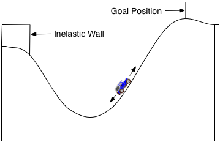
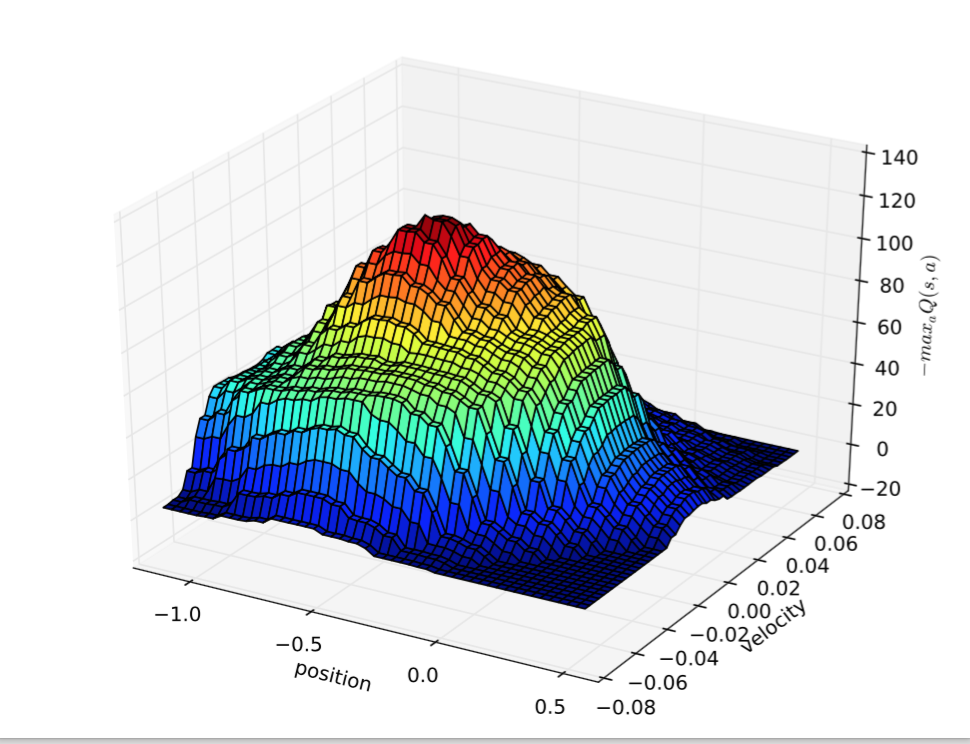
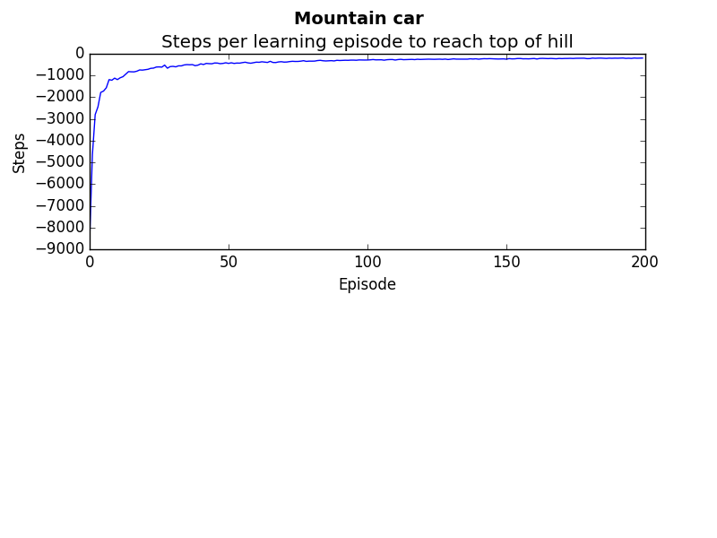

#Reinforcement learning for mountain car

##Problem Description
Consider the task of driving an underpowered car up a steep mountain road. 



The difficulty is that gravity is stronger than the car's engine, and even at full throttle, the car cannot accelerate up the steep slope. The only solution is to first move away from teh goal and end up the opposite slope on the left. Then, by applying full throttle the car can build up enough inertia to carry it up the steep slope even though it is slowing down the whole way. This is a simple example of a continuous control task where things have to get worse in a sense (farther away from goal) before they can get better. MAny control methodologies have great difficulties with tasks of this kind unless explicitly aided by a human controller. 

##Solution
We will use Reinforcement learning - DoubleQ learning with function approximation using tile coding to calculate an optimal policy for the car to reach the top of the hill.

##Usage
There are 3 main files:
1. Tilecoder.py. 
⋅⋅* This receives an state representation (position and velocity) and represents it as an approximation using Tile coding. Without approximation, the state space would be infinite in this task since speed and position are continuous values.
2. DoubleQ.py
⋅⋅* Responsible for the agent learning. 
⋅⋅* Contains a policy - mapping states to optimal actions
⋅⋅* learns based on state, reward, and nextState
3.  learn.py
⋅⋅* Is the controller. This is where you initiate the environment and begin the learning.

The simplest way to generate the learning rate would be to run these commands. This will display a plot of the learning rate:
```python
from learning import *
averages, theta1, theta2 = learn(numEpisodes = 200, numRuns = 50)
plot(averages)
```

##Results
The following are graphs created. The first showing the optimal actions at the different locations and velocities.



This diagram shows the learning rate of the agent. At first, the agent takes a long time to get up the hill (8000 steps). But begins after a while to be able to do it in much less than 200 steps.




##Reference
The mountain car problem description is taken from "An introduction to reinforcement learning" by Sutton and Barto. (https://webdocs.cs.ualberta.ca/~sutton/book/the-book.html)